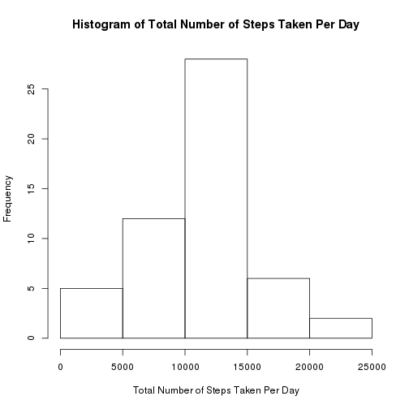
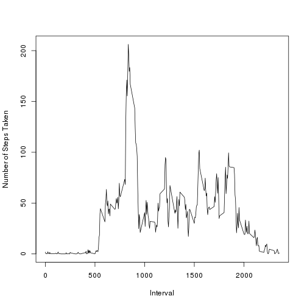
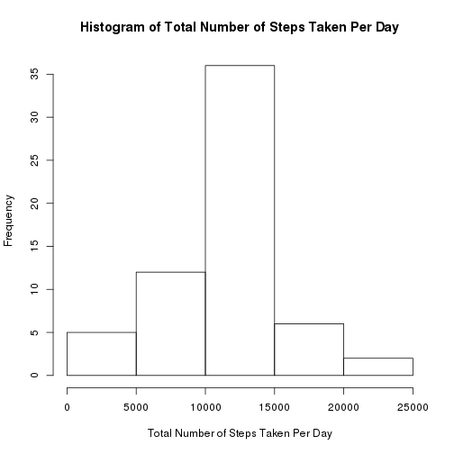
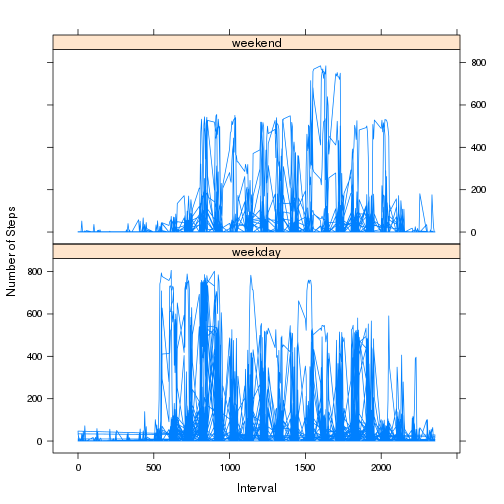

## Loading and preprocessing the data

```r
data <- read.csv("activity.csv")
```


## What is mean total number of steps taken per day?

```r
steps.per.day <- aggregate(data$steps, list(date = data$date), "sum")
colnames(steps.per.day)[2] <- "steps"
hist(steps.per.day$steps, main = "Histogram of Total Number of Steps Taken Per Day",
		 xlab = "Total Number of Steps Taken Per Day")
```

 

You can see in the summary the mean and the median.

```r
summary(steps.per.day$steps)
```

```
##    Min. 1st Qu.  Median    Mean 3rd Qu.    Max.    NA's 
##      41    8841   10760   10770   13290   21190       8
```


## What is the average daily activity pattern?

```r
average.steps.per.interval <- aggregate(data$steps, list(interval = data$interval), "mean", na.rm = TRUE)
colnames(average.steps.per.interval)[2] <- "steps"
plot(average.steps.per.interval$interval, average.steps.per.interval$steps, type = "l",
		 xlab = "Interval", ylab = "Number of Steps Taken")
```

 

Below is the interval that averages the most steps.

```r
average.steps.per.interval[which.max(average.steps.per.interval$steps), ]
```

```
##     interval    steps
## 104      835 206.1698
```


## Imputing missing values
Below is total number of missing values.

```r
sum(is.na(data$steps))
```

```
## [1] 2304
```
Each missing value is replaced by the rounded mean of its interval.

```r
new.data <- data
for(i in which(is.na(new.data)))
	new.data[i,"steps"] <- round(average.steps.per.interval[
		average.steps.per.interval$interval == new.data[i,"interval"], "steps"])
```
The new mean and the new median total number of steps taken per day are calculated.

```r
new.steps.per.day <- aggregate(new.data$steps, list(date = new.data$date), "sum")
colnames(new.steps.per.day)[2] <- "steps"
hist(new.steps.per.day$steps, main = "Histogram of Total Number of Steps Taken Per Day",
		 xlab = "Total Number of Steps Taken Per Day")
```

 

```r
summary(new.steps.per.day$steps)
```

```
##    Min. 1st Qu.  Median    Mean 3rd Qu.    Max. 
##      41    9819   10760   10770   12810   21190
```
With the way missing values were replaced, the impact is minimal. The mean and the median remain the same. Only the first and third quadrants are different.


## Are there differences in activity patterns between weekdays and weekends?

```r
daytype <- weekdays(strptime(new.data$date,"%Y-%m-%d"))
new.data$daytype <- factor(ifelse(daytype == "Saturday" | daytype == "Sunday", "weekend", "weekday"))
library(lattice)
xyplot(new.data$steps ~ new.data$interval | new.data$daytype, layout = c(1,2), type = "l",
			 xlab = "Interval", ylab = "Number of Steps")
```

 

Yes, there are differences in activity patterns between weekdays and weekends. There is more activity on weekdays overall, and activity is concentrated earlier in the day on weekdays compared to weekends.
